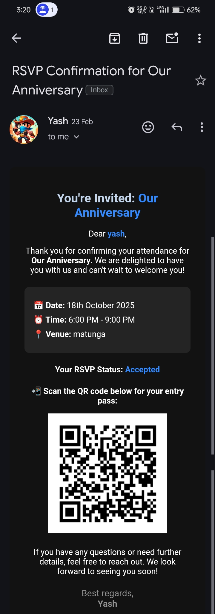

# 🎉 Eventify – Seamless Event Invitations & Smart RSVP System  

🚀 **A next-gen event invitation platform with QR-based check-ins & face recognition for event photos.** 🚀  

Eventify is a **MERN stack** application that allows users to create events, share invite links, track RSVPs, and use **AI-powered face detection** to filter event images. Guests can RSVP without logging in, receive a **QR entry pass**, and find their event photos effortlessly.  

---

## 🌟 Features  

- **Effortless Event Creation** 🎭  
  Users create events with details like name, date, location, and capacity.  

- **Seamless Guest Invitations** 🔗  
  Share a direct event link – no login required!  

- **Simple RSVP System** ✅❌  
  Guests RSVP by providing their name & email.  

- **Automated QR Entry Pass** 🎟️  
  Accepted guests receive a **QR code pass** for easy check-in.  

- **Media Upload & Face Recognition** 📸🤖  
  Guests can upload photos, and our **face detection AI** filters event images based on a provided face.  

- **Real-time RSVP Tracking** 📊  
  Hosts can monitor RSVP responses and manage guest lists.  

---

## 🛠️ Tech Stack  

- **Frontend:** React, Tailwind CSS, ShadCN  
- **Backend:** Node.js, Express.js  
- **Database:** MongoDB  
- **Email & QR Generation:** Nodemailer, QR Code API  
- **AI & Face Detection:** OpenCV  

---

## 📋 Key Functionalities  

1. **Event Creation & Sharing** – Users create events & share invite links.  
2. **Guest RSVP System** – Guests respond with their name & email.  
3. **QR Code Generation** – Automated entry passes for accepted guests.  
4. **Media Upload & AI Face Detection** – Guests can find their event photos via **AI-powered facial recognition**.  
5. **Admin Dashboard** – Hosts track RSVPs & manage event entries.  

---

## 📸 Screenshots  

### 1️⃣ Event Creation Page  
  

### 2️⃣ Guest RSVP Page  
  

### 3️⃣ Face Recognition in Album
  

### 4️⃣ QR Code Email  
 

---

## 📜 **Credits**  
- **Developers**: [@Shubham_Bendre](https://github.com/Shubham-Bendre), [@Malhar_Singh](https://github.com/Malhar2400), [@Yash_Chougule](https://github.com/YxASH)
- **Inspiration**: Apple Invite & AI-powered event management  

---

## 📂 
```
python -m uvicorn main:app --reload --port 8000
```
